# Лабораторная работа №2. Облачные вычислительные сервисы. Amazon EC2

| Сведения | Значение |
|---|---|
| ФИО | Северченко Сергей Денисович |
| Группа | IA2404 |
| Специальность | Прикладная Информатика |
| Уровень | Базовый, задания 1–6 |


## Цель работы

Освоить запуск и диагностику виртуальной машины Amazon EC2, подключение к ней по SSH, размещение статического сайта на nginx и остановку экземпляра через AWS CLI.

## Параметры учебного сервера

| Параметр | Значение |
|---|---|
| Имя экземпляра по заданию | `webserver` |
| Регион | `eu-central-1` — Europe (Frankfurt) |
| ОС по заданию | Amazon Linux 2023 |
| Тип экземпляра по заданию | `t3.micro` |
| Публичный IP во время работы | `3.70.158.208` |
| Внутренний IP | `172.31.23.197` |
| Пользователь SSH | `ec2-user` |
| Пара ключей | `sergey-keypair1` |
| Instance ID | [Вставить ID из консоли EC2] |


## Доказательства выполнения

### Задание 1. Подготовка аккаунта

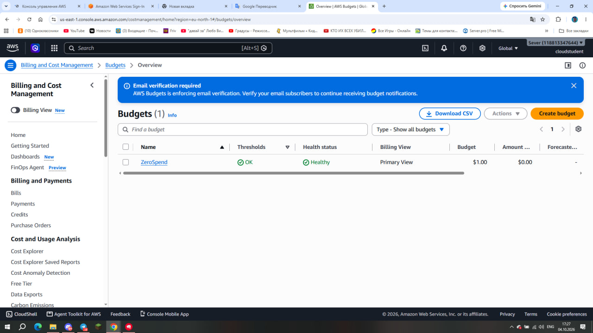

Рисунок 1 — бюджет `ZeroSpend` в списке AWS Budgets.

### Задание 2. Запуск экземпляра EC2

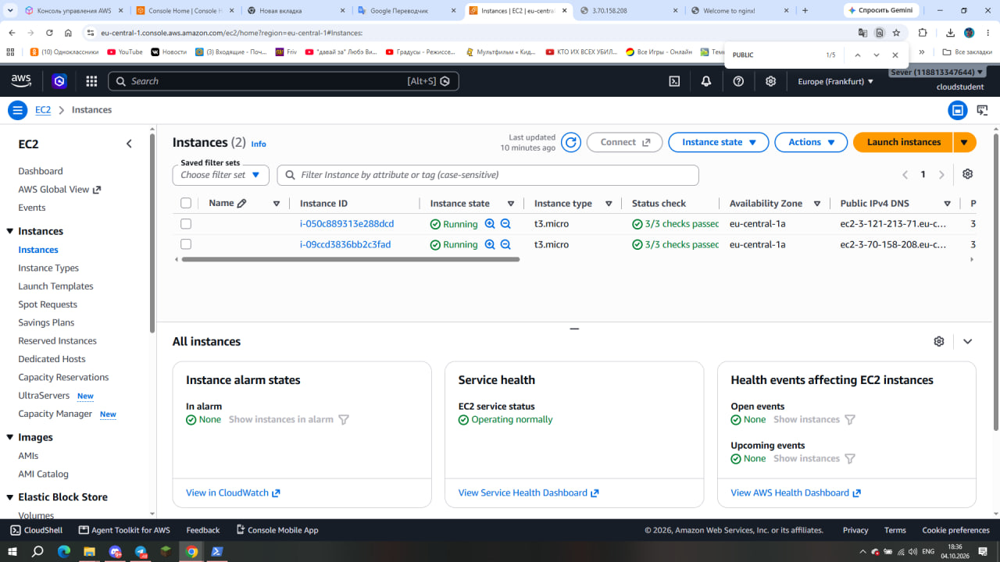

Рисунок 2 — экземпляр `webserver` в состоянии `Running` с успешно пройденными проверками состояния.

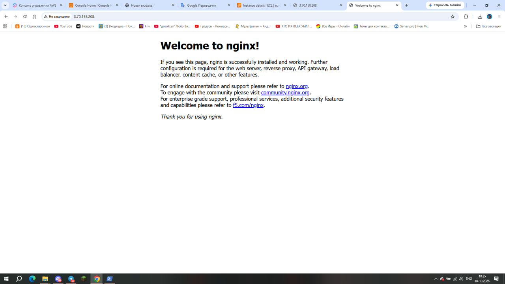

Рисунок 3 — приветственная страница nginx по адресу `http://3.70.158.208`.

### Задание 3. Мониторинг и диагностика

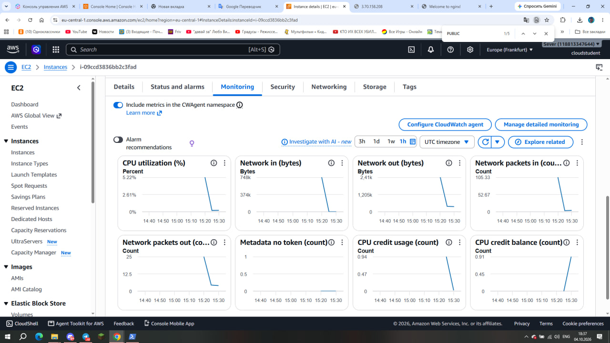

Рисунок 4 — вкладка `Monitoring` с метриками работы экземпляра.

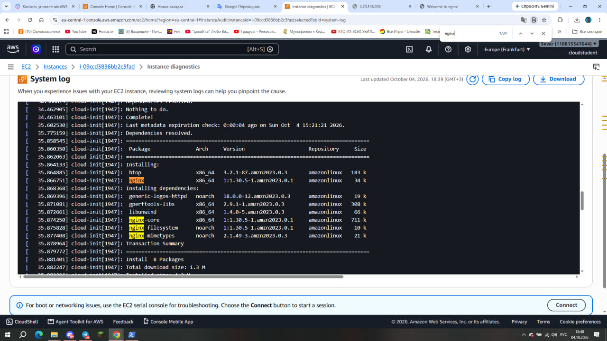
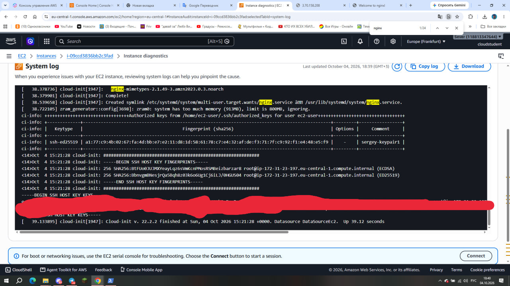

Рисунок 5 — фрагмент `System log` с установкой nginx скриптом User data.

### Задание 4. Подключение по SSH

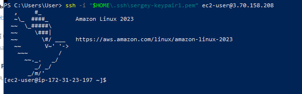
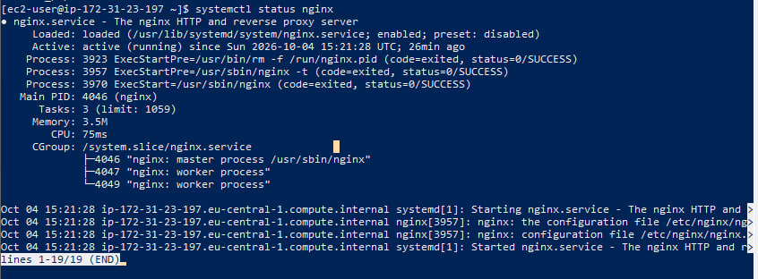

Рисунок 6 — подключение под пользователем `ec2-user` и вывод `systemctl status nginx` со статусом `active (running)`.

Команда подключения из PowerShell:

```powershell
ssh -i "$HOME\.ssh\sergey-keypair1.pem" ec2-user@3.70.158.208
```

В полученном выводе сервера указано:

```text
Loaded: loaded (/usr/lib/systemd/system/nginx.service; enabled; preset: disabled)
Active: active (running)
```

Статус `active (running)` подтверждает работу nginx; `enabled` означает, что для службы включён автозапуск.

### Задание 5. Статический сайт

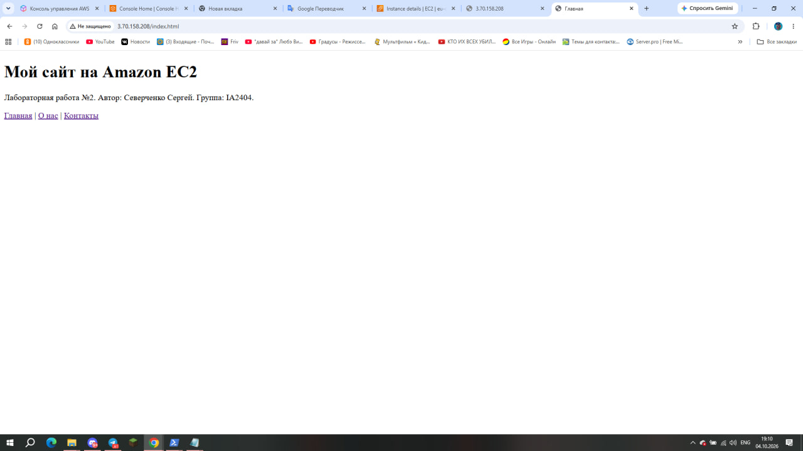

Рисунок 7 — учебный сайт, открытый в браузере по публичному IP экземпляра.

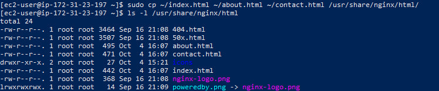

Рисунок 8 — вывод `ls -l /usr/share/nginx/html` с файлами `index.html`, `about.html` и `contact.html`.

Страницы сайта: главная (`index.html`), «О нас» (`about.html`) и «Контакты» (`contact.html`). Результат проверки переходов между всеми страницами: **[указать фактический результат]**.

### Задание 6. Остановка через AWS CLI

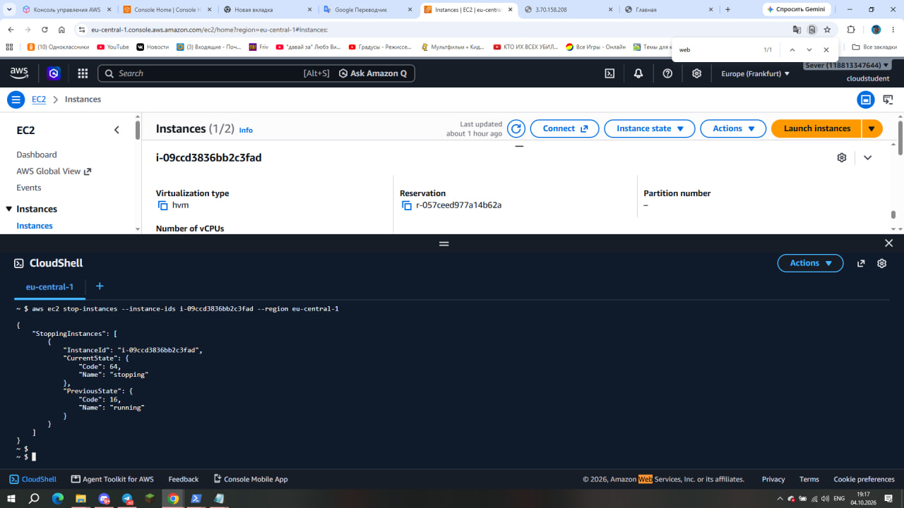

Рисунок 9 — команда `aws ec2 stop-instances` и ответ AWS CLI о переходе экземпляра в состояние `stopping`.

Используемая форма команды (вместо `INSTANCE_ID` указывается реальный идентификатор):

```bash
aws ec2 stop-instances --instance-ids INSTANCE_ID --region eu-central-1
```

Итоговое состояние экземпляра после ожидания: **[проверить и указать]**. По условию лабораторной экземпляр следует остановить, сохранив его для дальнейшего использования.

## Ответы на контрольные вопросы

### 1. Что разрешает AdministratorAccess? Почему для повседневной работы не используют root?

Политика AdministratorAccess предоставляет полный доступ к действиям и ресурсам AWS, однако действующие запреты и ограничения организации могут его ограничивать. Root — главный пользователь аккаунта с особыми полномочиями, поэтому утечка его данных особенно опасна. Для повседневной работы используют отдельную учётную запись, а root оставляют для задач, которые требуют именно его прав.

### 2. Что такое User data и когда выполняется скрипт? Повторится ли он после перезагрузки?

User data позволяет передать экземпляру команды первоначальной настройки. В этой работе скрипт обновляет пакеты, устанавливает htop и nginx, запускает nginx и включает его автозапуск. По умолчанию такой shell-скрипт выполняется при первом запуске экземпляра и не повторяется после обычной перезагрузки. Сама служба nginx запускается повторно благодаря настройке автозапуска.

### 3. Какая проверка указывает на проблему пользователя, а какая — AWS?

System status check проверяет инфраструктуру AWS, поэтому её сбой обычно связан с физическим сервером или сетью провайдера. Instance status check проверяет доступность самой виртуальной машины и может указать на проблемы ОС или сетевых настроек, которые пользователь способен исправить. Attached EBS status check показывает, доступны ли подключённые тома и могут ли они выполнять операции ввода-вывода.

### 4. В каких случаях стоит включать детальный мониторинг?

Детальный мониторинг полезен для приложений с переменной нагрузкой, когда важно быстрее обнаруживать изменения и реагировать на них. Он предоставляет стандартные метрики EC2 с интервалом в одну минуту вместо пяти минут. Для небольшого учебного сайта базового мониторинга обычно достаточно, а подробный включают при необходимости с учётом дополнительной стоимости.

### 5. Почему для входа на экземпляр используется ключ, а не пароль?

При подключении SSH сервер проверяет, что клиент владеет приватным ключом, соответствующим разрешённому публичному ключу. Приватный ключ остаётся на компьютере пользователя и не передаётся серверу. Такой способ при правильном хранении ключа позволяет отказаться от входа по подбираемому паролю; в стандартной конфигурации выбранного образа применяется именно ключевая аутентификация.

### 6. Что делает scp и чем она похожа на ssh?

Команда scp копирует файлы между локальным компьютером и удалённым сервером. Она использует защищённое соединение SSH и тот же приватный ключ для аутентификации. В этой работе scp передаёт HTML-файлы, тогда как ssh позволяет выполнять команды на сервере.

### 7. Чем Stop отличается от Terminate? За что продолжается оплата после остановки?

Stop останавливает экземпляр с возможностью последующего запуска, сохраняя его EBS-тома. Terminate удаляет экземпляр, а судьба каждого EBS-тома зависит от настройки Delete on termination. После остановки не оплачивается вычислительное время остановленного экземпляра, но продолжается оплата сохраняемого EBS-хранилища и других оставшихся платных ресурсов, например снимков дисков или выделенного Elastic IP, если они созданы. Обычный автоматически назначенный публичный IPv4 при остановке освобождается и после запуска может измениться.

Дополнительные вопросы о PostgreSQL, GitHub, deploy.sh и CI/CD относятся к продвинутому уровню и в выбранную базовую часть не входят.

## Вывод

Подтверждены подключение к экземпляру Amazon EC2 по SSH с использованием ключа и работоспособность nginx. Базовая часть работы также предусматривает настройку бюджета, изучение метрик и системного журнала, публикацию трёх связанных HTML-страниц и остановку экземпляра через AWS CLI. Окончательное выполнение этих пунктов подтверждается приложенными скриншотами и результатами проверок выше.

